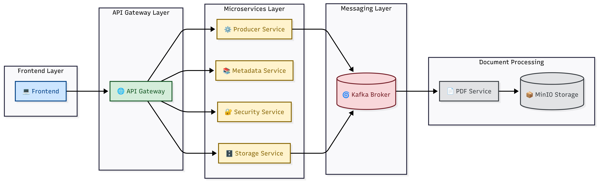

# Projekt-Ksef
# KSeF Clone – Distributed E-Invoice System

Microservice-based system inspired by the Polish National e-Invoice System (KSeF).

The application supports invoice creation, asynchronous PDF generation, metadata processing, file storage in MinIO, OAuth2/JWT authentication with Keycloak, Kafka event-driven communication and API Gateway request routing.

Built with Spring Boot, Kafka, PostgreSQL, MinIO, Docker and Keycloak.

## Architecture



## Features

- Invoice creation API
- Event-driven architecture with Apache Kafka
- Asynchronous PDF invoice generation
- File storage using MinIO (S3-compatible)
- Metadata extraction service
- OAuth2 / JWT authentication with Keycloak
- API Gateway routing and request limiting
- PostgreSQL persistence
- Dockerized infrastructure
- Microservice communication via Kafka events

## Tech Stack

### Backend
- Java 21
- Spring Boot 3
- Spring Security
- Spring Cloud Gateway
- Spring Data JPA
- Spring Kafka

### Infrastructure
- Apache Kafka
- PostgreSQL
- Docker
- Docker Compose
- MinIO
- Keycloak

### Security
- OAuth2
- JWT

### Storage
- MinIO (S3 compatible storage)

## Microservices

### producer-service
Responsible for invoice creation and publishing Kafka events.

### pdf-service
Consumes invoice events and asynchronously generates PDF documents.

### storage-service
Uploads generated PDFs to MinIO object storage.

### metadata-service
Consumes invoice events and stores metadata in PostgreSQL.

### security-service
Handles user registration and Keycloak integration.

### api-gateway
Routes requests and validates JWT access tokens.

## Run locally

### Requirements

- Java 21
- Docker
- Maven

### Start infrastructure

```bash
docker compose up -d
```

### Run microservices

```bash
mvn spring-boot:run
```

Services:

- API Gateway → `localhost:8080`
- Producer Service → `localhost:8081`
- PDF Service → `localhost:8082`
- Metadata Service → `localhost:8083`
- MinIO → `localhost:9001`
- Keycloak → `localhost:8089`
- Kafka UI → `localhost:8084`

## Authentication

```http
POST /realms/ksef/protocol/openid-connect/token
```

### Example request

```bash
curl --location 'http://localhost:8089/realms/ksef/protocol/openid-connect/token' \
--form 'client_id="ksef-client"' \
--form 'username="admin"' \
--form 'password="password"' \
--form 'grant_type="password"'
```